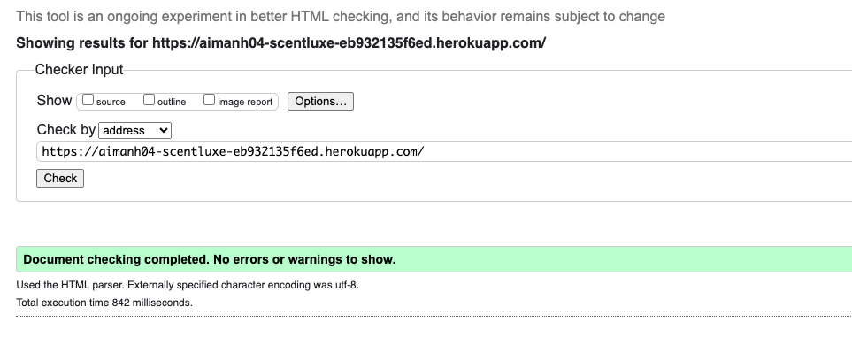
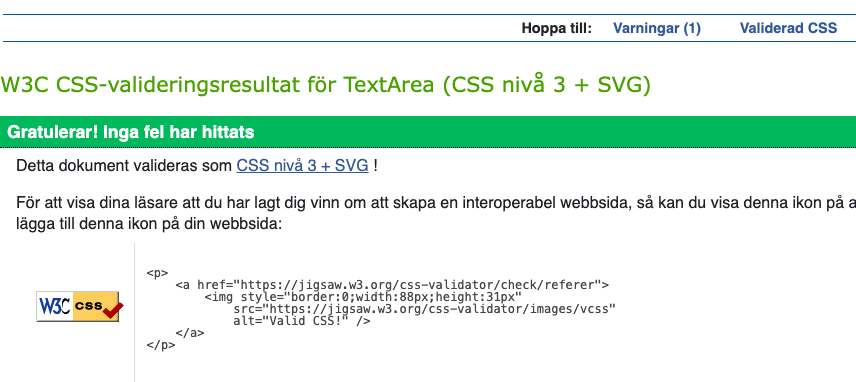
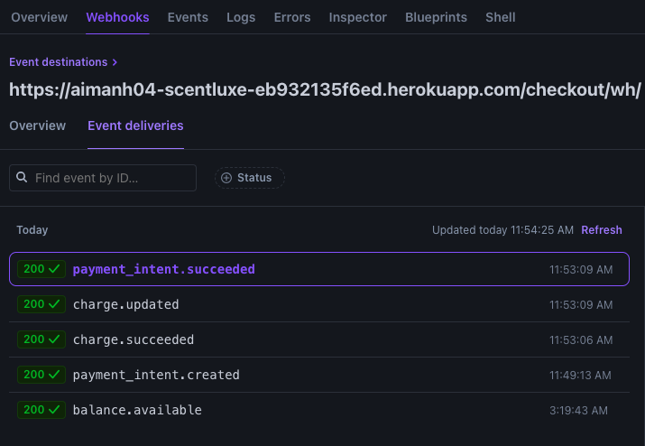

# PP5-scent_luxe

Link to the live project: [ScentLuxe](https://aimanh04-scentluxe-eb932135f6ed.herokuapp.com/)

Welcome to the **ScentLuxe**!
ScentLuxe is a Django-powered ecommerce application built to offer a seamless and elegant shopping experience for luxury candle and fragrance lovers. The platform features a curated collection of handcrafted candles made from repurposed champagne bottles, each with its own unique story and scent profile.

Users can browse products, leave reviews, manage their accounts, and complete purchases securely through a Stripe-integrated checkout system. Designed with performance and style in mind, ScentLuxe combines functionality and sophistication to deliver a premium online shopping experience.

## TABLE OF CONTENTS

- [USER EXPERIENCE](#user-experience)
- [DESIGN](#design)
- [FEATURES](#features)
- [WEB MARKETING](#web-marketing)
- [CODE TECHNOLOGIES USED](#code-technologies-used)
- [TESTING](#testing)
- [VALIDATION](#validation)
- [DEPLOYMENT](#deployment)
- [CREDITS](#credits)

## USER EXPERIENCE

#### Agile Methodology

Agile

The ScentLuxe project followed Agile methodology, using iterative sprints to prioritize key features and improve based on user feedback. The MoSCoW method helped classify features, ensuring core functionalities like browsing, authentication, and recipe management were developed first. Continuous testing and refinements kept the platform user-friendly and responsive.

#### MoSCoW

MoSCoW

This project applied the MoSCoW prioritization technique to categorize its features and requirements based on their significance in achieving a minimum viable product (MVP). The MoSCoW method divides features into four groups: "Must have," "Should have," "Could have," and "Won't have," ensuring a structured approach to prioritization. By using this framework, the project focuses first on the most critical elements, guaranteeing that essential functionalities are addressed before less urgent ones.

#### First-Time User Goals
- Understand the website's purpose and luxury branding from the homepage
- Navigate the main menu with ease to explore the Shop, About, FAQ, and Contact pages
- Browse available Candles and view full product details without needing to register
- Learn about each candle's story, scent profile, and origin (e.g. Champagne bottle source)
- Trust the brand through visual cues of quality: elegant product image, and clear design
- Sign up for an account to access personalized features such as saved orders and review submissions
- View the cart and checkout process intuitively with no confusion or unnecessary steps
- Feel confident in the legitimacy and security of the store through visible payment and trust signals

#### Returning User Goals
- Log into their account effortlessly and resume shopping or managing orders
- Access their user profile to view past orders, submitted reviews, and saved details
- Leave new product reviews and edit or delete their previous reviews as needed
- Quickly browse best-sellers, new arrivals, or shop by scent category or collection
- Engage with other customers by reading shared reviews and product feedback
- Reorder previously purchased items directly from the profile or order history section
- Experience fast page load times and smooth navigation across all devices

#### As an Admin User
- Log into the admin panel securely using Django's authentication system
- Add, edit, or delete product listings including images, pricing, scent notes, and stock levels
- Manage user-submitted reviews with full CRUD permissions to maintain content quality
- Oversee all orders and update order statuses, refunds, or shipping notes when needed
- Edit core site content such as homepage text, FAQ answers content
- Maintain overall site cleanliness and performance to ensure consistent user satisfaction

## DESIGN

### Color Scheme

### Database Models

## FEATURES

### Blog Features

 

<strong>Nav Bar</strong>

- Displays links like **Home**, **Shop**, **About**, **Contact**, and **FAQ**.
- Shows **Login/Sign Up** or **Profile/Logout** based on user status.
- Admins see an extra **Product Management** link.
- Includes a responsive search bar, cart icon, and clickable ScentLuxe logo.

<strong>Home Page</strong>

- Features a full-width hero image with a call-to-action ("Shop Now") button.
- Highlights the brand’s message: “Discover the finest and most luxurious candles.”
- Includes a persistent free shipping banner above the main content.
- Clicking "Shop Now" redirects users directly to the product listing page.

 

<strong>All Products Page</strong>

- Displays all products in a responsive grid layout with consistent spacing and styling.
- Each item shows a product image, name, price, and clickable link to the detail page.
- Includes filter functionality by category (e.g., Candles, Diffusers, Gifts & Bundles).
- Allows users to sort by price or category using a dropdown.
- A search bar is available to find products by name or keyword.

 

<strong>Product Detail Page</strong>

- Shows detailed information including product image, name, description, and price.
- Allows users to select a quantity and add the item to their shopping bag.
- Displays the average user rating based on submitted reviews.
- Authenticated users can submit a review with a rating, title, and message.
- All submitted reviews are visible below the product, including the reviewer name and date.
- Admin users can edit or delete the product from the admin panel if needed.

 

<strong>Review System</strong>

- Logged-in users can submit reviews directly from the product detail page.
- Reviews include a star rating, title, and written feedback.
- The median rating is automatically calculated and displayed on each product.
- Users can view all reviews, including submission date and reviewer username.
- Users can delete their own reviews from the profile page.
- Admins can view and delete any review via the admin panel.

 

<strong>FAQ Page</strong>

- Organized into collapsible accordion sections for easy navigation.
- Covers common topics like Candles, Orders & Shipping.
- Questions expand smoothly to reveal detailed answers without reloading the page.

 

<strong>Contact Page</strong>

- Features a clean and responsive contact form with fields for name, email, and message.
- Uses Django forms and CSRF protection for secure submissions.
- Submits user inquiries directly to the admin panel.
- Displays success or error messages to confirm form status.

 

<strong>About Page</strong>

- Provides background on the ScentLuxe brand and its purpose.
- Highlights the project creator and development context (Portfolio Project 5).
- Includes a high-quality logo image to reinforce brand identity.
- Clean, centered layout with responsive formatting for all screen sizes.

 

<strong>Profile Page</strong>

- Displays the user's saved delivery details, which can be updated via a secure form.
- Lists all past orders with links to view order history and details.
- Shows all reviews written by the user, including the product name and date.
- Users can delete their own reviews directly from this page.
- Access restricted to logged-in users only.

 

<strong>Shopping Bag</strong>

- Displays a summary of all items the user has added to their bag.
- Shows product image, name, price, quantity, and subtotal.
- Users can update item quantities or remove items entirely.
- Automatically calculates total cost and delivery fees.
- Bag total is visible at all times in the navigation bar.

 

<strong>Checkout Page</strong>

- Users can securely enter their delivery and payment information.
- Integrated with **Stripe** for handling credit/debit card payments.
- Authenticated users can save their info for faster future checkouts.
- Displays an order summary, including items, quantities, and totals.
- Validates form fields and provides real-time feedback for errors.

 

<strong>Checkout Success Page</strong>

- Confirms that the user’s order was placed successfully.
- Displays a full order summary with product details, prices, and delivery address.
- Shows the email used for confirmation and notifies that a receipt has been sent.
- Logged-in users can view this order again from their profile page.

 

<strong>Sign-Up/Register Page</strong>

- New users can register by entering their email, username, and password.
- Includes email confirmation and password validation for added security.
- Users are redirected to the homepage upon successful registration.
- Once signed up, users can access profile features, leave reviews, and place orders.

 

<strong>Sign-In Page</strong>

- Allows users to log in using their email or username and password.
- Includes a "Remember Me" option for persistent sessions.
- Provides links to sign up for new users and reset password if forgotten.
- Successful login redirects users to the homepage or their intended destination.

 

<strong>Footer</strong>

- Includes a “Stay in Touch” section with links for social engagement.
- Offers a Mailchimp-powered subscription form for email newsletter sign-up.
- Encourages users to follow ScentLuxe on Facebook for updates and promotions.
- Fully responsive layout styled to match the brand’s color scheme.

## WEB MARKETING

## CODE TECHNOLOGIES USED

### Languages

- Python
- HTML
- JavaScript
- CSS

### Frameworks, Libraries and Programes used

- [GitHub](https://GitHub.com/) - To save and store files for the project
- [VSCode](https://code.visualstudio.com) - Used as workspace for my project
- [Am I Responsive](https://techsini.com/multi-mockup/index.php) - Used to test responsivness
- [PEP8 CI Python Linter](https://pep8ci.herokuapp.com/) - Used to validate my python code.
- [Heroku](https://dashboard.heroku.com/) - Used to deploy project.
- [Amazon-AWS](https://aws.amazon.com/) - was used host all static and media files for the site.
- [Chrome Devtools](https://developer.chrome.com/docs/devtools) - Used throughout the process to find bugs and test responsiveness on website
- [JSHint](https://jshint.com/) - To validate JavaScript code
- [W3C Markup Validation](https://validator.w3.org/) - To validate HTML code
- [W3C CSS Validation](https://jigsaw.w3.org/css-validator/) - To validate CSS code
- [Pexels](https://www.pexels.com/) - For Hero image
- [Bootstrap](https://getbootstrap.com) - Used to style website and add better responsiveness and interactivity

### Installed Django & Essential Packages

- **Django**: Main web framework used to build the ScentLuxe eCommerce platform.
- **Gunicorn**: WSGI server for running Django in production (used on Heroku).
- **Flake8**: Python linter that enforces clean code and PEP8 compliance.
- **dj-database-url**: Parses the database URL from environment variables (used with Heroku + PostgreSQL).
- **psycopg2-binary**: PostgreSQL adapter for Django to connect to a remote PostgreSQL database.
- **Django Allauth**: Handles user authentication, registration, and social login.
- **Crispy Forms**: Improves the rendering of Django forms with Bootstrap integration.
- **Django Summernote**: Adds a rich-text editor to the Django admin for editable content fields.
- **django-storages**: Enables Django to use Amazon S3 for media file storage.
- **boto3**: AWS SDK used alongside `django-storages` to interact with S3.
- **stripe**: Python library used to integrate Stripe for secure payment processing.

## TESTING

### Manual Testing

#### Registration Testing

| Test Case | Status |
|-----------|--------|
| Account creation is successful | Passed |
| Login with created credentials | Passed |
| Logout functionality works correctly | Passed |

#### Navigation Testing

| Test Case | Status |
|-----------|--------|
| All pages are accessible | Passed |
| Navigation menu items are visible | Passed |
| Users can access posts successfully | Passed |

#### User Actions and Expected Outcomes

| Action Performed | Expected Result | Outcome |
|:------------------|:----------------|:-------:|
| User uses the search bar | Products matching the search query are displayed | Passed |
| User filters by category | Products in the selected category are shown | Passed |
| User views product detail page | Full product information, price, and reviews are displayed | Passed |
| User adds a product to the shopping bag | Product is added and bag total is updated | Passed |
| User views shopping bag | All added items with quantities and prices are displayed | Passed |
| User updates quantity in shopping bag | Total is recalculated based on new quantity | Passed |
| User removes an item from the bag | Item is removed and total is updated | Passed |
| User proceeds to checkout | Checkout form appears with pre-filled profile data if available | Passed |
| User enters delivery and payment info | Stripe processes payment and order confirmation page is shown | Passed |
| User receives a confirmation email | Email is delivered to user with order details | Passed |
| User views their profile | Profile info, order history, and submitted reviews are displayed | Passed |
| User updates default delivery info | New info is saved and used in future checkouts | Passed |
| User views an order confirmation from profile | Full order details and status are displayed | Passed |
| User submits a product review | Review is saved, linked to user, and displayed on the product page | Passed |
| User views all their reviews in profile | All reviews made by the user are visible | Passed |
| User navigates to the FAQ page | Common questions and answers are displayed | Passed |
| User visits the About page | Brand story and product philosophy are shown | Passed |
| User uses the contact form | Message is sent and a success notification is shown | Passed |

#### Layout and Functionality

| Test Action | Expected Result | Outcome |
|:------------|:----------------|:-------:|
| All pages are fully responsive on desktop, tablet, and mobile | Layout adapts to screen size without breaking | Passed |
| Product grid displays correctly on all devices | Product images and text align and scale properly | Passed |
| Shopping bag icon in nav updates correctly when items are added | Bag count increases and total is updated | Passed |
| Forms (login, signup, checkout, contact) are styled and usable | Input fields display correctly with proper spacing | Passed |
| Star rating system displays cleanly on product pages | Stars are properly aligned and visually distinct | Passed |
| Review section is well-structured under product details | Reviews are displayed with username, rating, and comment | Passed |
| Toast/success/error messages are clearly visible and styled | Bootstrap alerts show in correct colors and positions | Passed |
| Footer and navigation bar remain fixed and accessible | Navigation remains intuitive and links are functional | Passed |

#### Admin Testing

| Test Action | Expected Result | Outcome |
|:------------|:----------------|:-------:|
| Admin logs into Django admin panel | Admin dashboard is accessible with all registered models | Passed |
| Admin adds a new product | Product is created and appears on the storefront | Passed |
| Admin edits an existing product | Product updates are saved and reflected on the site | Passed |
| Admin deletes a product | Product is removed from the storefront and database | Passed |
| Admin views all customer orders | Orders with user info, line items, and totals are displayed | Passed |
| Admin views individual order detail | Order contents, delivery info, and Stripe payment ID are visible | Passed |
| Admin deletes a customer review | Review is removed from the product page and admin list | Passed |
| Admin modifies site content (e.g. FAQ) | Updated content is saved and live on the site | Passed |
| Admin accesses and manages contact form messages | Messages are listed and viewable in the admin panel | Passed |
| Stripe payments appear in dashboard after order | Successful payments are recorded and matched with order ID | Passed |
| Admin panel remains secure and only accessible to staff | Non-admin users are restricted from accessing the admin URL | Passed |

### Chrome Developer Tools  

Chrome Developer Tools were utilized throughout the development process to ensure responsiveness. The responsiveness of the webpage was tested by emulating various devices, including:

- Desktops  
- Laptops  
- Tablets  
- Mobile phones  

### Browser Testing  

During development, testing was conducted primarily on Google Chrome. In production, the website has been tested across multiple browsers, including:

- Google Chrome  
- Microsoft Edge  
- Mozilla Firefox  

## VALIDATION

### Validators

#### W3C HTML Validator

<strong>HTML Validation</strong>

I used the recommended [HTML W3C Validator](https://validator.w3.org/nu) to validate all of my HTML pages.

| Page             |    W3C Screnshots                                         |             
| -----------------|-----------------------------------------------------------|
| Home             |              |
| Products         |           |            
| Product Detail   |           |
| FAQ              |                |
| Contact          |        |
| About Us         |            |
| Register         |        |
| Login            |            |
| Profile          |        |
| Bag              |                |
| Add Review       |         |
| Checkout         |         |
| Product Manage   |          |

#### W3C CSS Jigsaw Validator

<strong>CSS Validation</strong>

I used the recommended [CSS W3C Validator](https://validator.w3.org/nu) to validate all of my CSS Files.

| CSS              |    W3C Screnshots                                     |             
| -----------------|-------------------------------------------------------|
| Base.CSS         |                   |
| Profile.CSS      |             |            
| FAQ.CSS          |                     |
| Checkout.CSS     |           |

#### JSHint

<strong>JSHint Validation</strong>

I used the recommended [JSHint Validator](https://jshint.com/) to validate all of my JS Code.

| JS            |    W3C Screnshots                                     |             
| -----------------|------------------------------------------------------|
| Stripe_elements.js         |                  |
| Countryfield.js      |            |            

#### CI Python Linter

<strong>Python Linter Validation</strong>

To fix and refactor my code I used the recommended **Flake8** to refine my python code.
The remaining errors is code I can't change and supposed to be there.

| Python           |    W3C Screnshot                                     |             
| -----------------|------------------------------------------------------|
| Flake8           |                  |

#### Stripe Payments

<strong>Stripe Validation</strong>

**Stripe** was just as a payment system and here are screenshots of the payment system working.

| Stripe           |    Stripe Screenshot                                                |             
| -----------------|---------------------------------------------------------------------|
| Stripe Success   |                 |
| Stripe Failed    |                   |

### Unsolved Bugs

- No unsolved bugs.

## DEPLOYMENT

### Steps for deployment on Heroku
1. Go to the [Heroku](https://dashboard.heroku.com/) website.
2. Click on the "Create new app" option on the dashboard.
3. Give it your project name, select your region and go on the "Create app" option.
4. Click the settings tab.
5. Go to "Reveal Config Vars" and store all your sensitive data such as creds.json & port data.
6. Set the buildbacks to Python & Nodejs in that order.
7. Click on the deploy tab.
8. Select Github as a deployment method.
9. Connect it to your Github.
10. Authorize the correct repo to connect.
11. Choose to either "Enable Automatic" or on "Deploy Branch" to deploy the project.
12. Go on "View" to see your live project.

### Stripe API

### Gmail API

### Amazon S3

### Amazon IAM

### Forking the Github Repository
The steps to fork the github repository are:
1. Log in to your [GitHub](https://github.com/).
2. Go to the repository for your project.
3. Click fork on the right hand side of the screen.

### Making a local clone
To clone this repository, do the following steps:
1. Log in to your [GitHub](https://github.com/).
2. Go to the repository for this project []
().
3. Click on the code button and select whether you would like to clone with HTTPS, SSH or GitHub CLI and then copy the URL to your clipboard.
4. Open the terminal in your selected code editor and change the current working directory to the location of where you want the cloned directory.
5. Type "git clone" into the terminal, paste the link you copied and press enter.

## CREDITS

### Imagery

### Special Thanks To

- **Boutique Ado** This walkthrough was heavily relied upon my project due to time constraint and was extremily helpful. However, I did remake the design and made it my own.

- [LuxurySparkle](https://www.luxurysparkleco.com/) - This website was my original inspiration for wanting to make a candle website and I also give all the credit to them for their products because I used their imagery and products for my project.

- **Code Institute** for providing the foundational python knowledge.

- **Stack Overflow** for helpful solutions regarding python code and error handling.

- **W3Schools** for helpful solutions regarding python code and error handling.

- **Slack Community** for guidance and help

- Special thanks to all the tutors who has helped me in this project with troubleshooting assistance

### Other students projects

I took alot of inspiration from other students who made a similar project to mine

* Loveflowers.IE by Conal2023
[Loveflowers.IE | (https://loveflowers-conal-4ff1b669baa9.herokuapp.com/)](https://loveflowers-conal-4ff1b669baa9.herokuapp.com/ "Loveflowers.IE | (https://loveflowers-conal-4ff1b669baa9.herokuapp.com/)")

* Bake Me Happy by Sarah-bue    
[Bake Me Happy | (https://bake-me-happy-b9b73285e6cc.herokuapp.com/)](https://bake-me-happy-b9b73285e6cc.herokuapp.com/ "Bake Me Happy | (https://bake-me-happy-b9b73285e6cc.herokuapp.com/)")

* Boutique Shop by BadrAlioui    
[Boutique Shop | (https://boutique-shop-9cbda2d44e62.herokuapp.com/)](https://boutique-shop-9cbda2d44e62.herokuapp.com/ "Boutique Shop | (https://boutique-shop-9cbda2d44e62.herokuapp.com/)")

* Little Plant Shop by AtsukoCoffey   
[AtsukoCoffey | (https://little-plant-shop-e08318b823f1.herokuapp.com/)](https://little-plant-shop-e08318b823f1.herokuapp.com/ "AtsukoCoffey | (https://little-plant-shop-e08318b823f1.herokuapp.com/)")